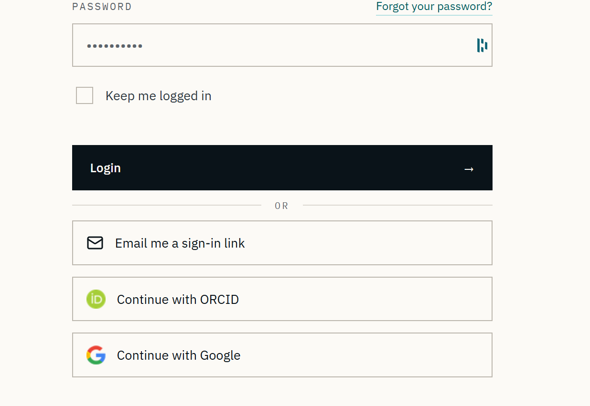
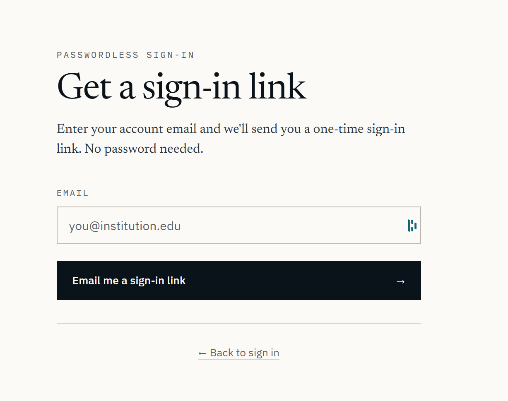
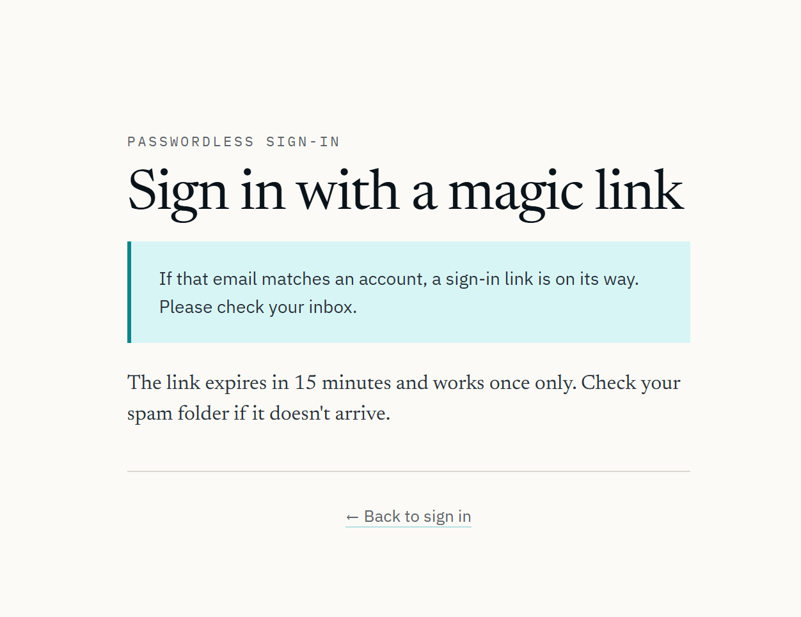
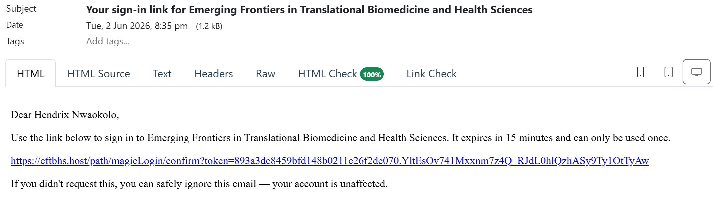
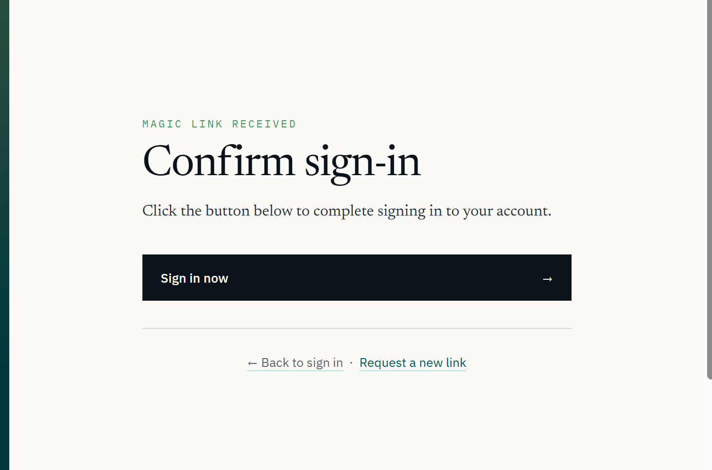
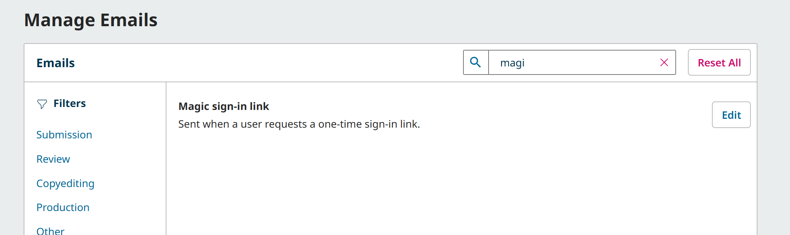
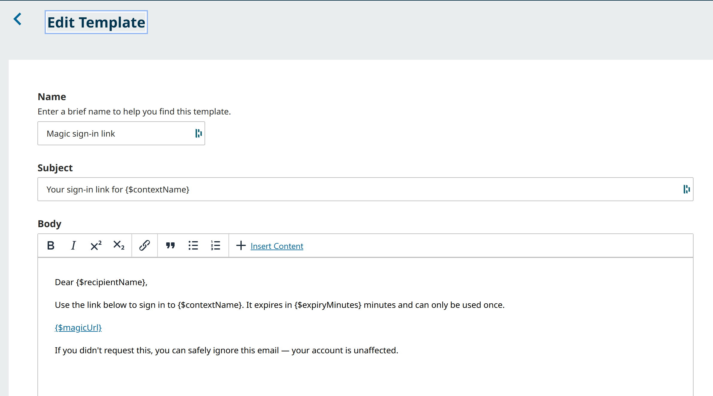

# OJS Magic Login

<table>
<tr>
<td><strong>Version</strong></td><td>1.2.1</td>
<td><strong>OJS</strong></td><td>3.5.0+</td>
<td><strong>PHP</strong></td><td>8.1+</td>
<td><strong>License</strong></td><td>GPL-3.0-or-later</td>
</tr>
</table>

[](https://github.com/thathman/ojs-magic-login/actions/workflows/ci.yml)
[](https://github.com/sponsors/thathman)

Passwordless sign-in for Open Journal Systems 3.5. Users receive a one-time link by email and sign in with a single click — no password required. Works alongside the standard login; neither flow replaces the other.

---

## Screenshots

<br>

**The "Email me a sign-in link" button is injected below the password form, alongside any other sign-in options already active on the journal.**



<br>

**Clicking the button opens a focused request page where the user enters their account email.**



<br>

**The response is always identical regardless of whether the email matched an account, preventing user enumeration.**



<br>

**The email is delivered immediately with a personalised greeting, the one-time link, and an expiry notice.**



<br>

**Clicking the link in the email brings the user to a one-click confirm page. The token is verified read-only on GET; it is consumed only when the user clicks Sign in now.**



<br>

**The email template appears in Settings › Emails and is fully editable by journal managers — no code changes required.**



<br>

**Managers can customise the subject and body. Template variables are inserted via the Insert Content picker.**



---

## Features

- One-time email links with configurable expiry (default 15 minutes)
- Per-account minimum interval between requests (default 60 seconds)
- Per-IP sliding-window rate limiting on both the send and verify endpoints
- Selector / verifier token scheme — only `sha256(verifier)` is stored; the database never holds a usable secret
- Token consumed atomically before session creation (single-use guarantee)
- Neutral send response — identical whether the email matched an account or not
- Email template editable from **Settings › Emails** (key `MAGIC_LOGIN_LINK`)
- Settings panel in **Settings › Website › Plugins** — enable/disable per journal, configure TTL and throttle
- Theme-override support — supply `request.tpl` / `confirm.tpl` inside your theme to apply a custom design
- Zero modifications to OJS core files — hooks only

---

## Requirements

| | Minimum version |
|---|---|
| OJS | 3.5.0 |
| PHP | 8.1 |

---

## Installation

### ~~Via Plugin Gallery~~

~~Search for **Passwordless Sign-in (Magic Link)** in **Settings › Website › Plugins › Plugin Gallery** and click Install.~~

*Pending Plugin Gallery approval — use manual installation for now.*

### Manual

1. Download `magicLogin.tar.gz` from the [Releases](../../releases) page.
2. Unpack into `plugins/generic/` so the result is `plugins/generic/magicLogin/`.
3. In OJS go to **Settings › Website › Plugins › Generic Plugins**, find **Passwordless Sign-in (Magic Link)** and click **Enable**.
4. Click **Settings** and tick **Enable magic-link sign-in for this journal**.

> **Note — versions table**
>
> If you drop the files in manually without using the OJS plugin installer, OJS will not detect the plugin until a row exists in the `versions` table. Run this once after copying the files:
>
> ```sql
> INSERT INTO versions
>   (major, minor, revision, build, date_installed, current,
>    product_type, product, product_class_name, lazy_load, sitewide)
> VALUES (1,2,1,0,NOW(),1,
>   'plugins.generic','magicLogin','MagicLoginPlugin',1,0);
> ```
>
> The Plugin Gallery installer handles this automatically.

---

## Configuration

| Setting | Range | Default | Description |
|---------|-------|---------|-------------|
| Enable magic-link sign-in | on / off | off | Activates the feature for this journal |
| Link validity | 1 – 120 min | 15 min | How long an emailed link remains usable |
| Minimum seconds between requests | 30 – 3600 s | 60 s | Per-account throttle |

---

## How it works

```
User enters email        POST /magicLogin/send
                           IP rate-limit check
                           look up account  (response is identical either way)
                           issue selector + verifier
                           store selector and sha256(verifier)
                           email  /magicLogin/confirm?token=<selector>.<verifier>
                           show neutral "check your inbox" page

User clicks email link   GET /magicLogin/confirm?token=...
                           validate token format (regex)
                           look up selector in DB, check hash + expiry  (read-only)
                           show "Sign in now" button

User clicks Sign in      POST /magicLogin/login
                           IP rate-limit check
                           re-verify token
                           consume token  (delete from DB before session creation)
                           establish OJS session
                           redirect to dashboard
```

---

## Security

| Property | Implementation |
|----------|----------------|
| Secret storage | Only `sha256(verifier)` stored; raw verifier never touches the database |
| Timing attack prevention | `hash_equals()` for constant-time comparison |
| Single-use | Token deleted before session creation; replay is impossible |
| Short expiry | 15 minutes by default; administrator-configurable |
| Rate limiting | Per-IP sliding window: 5 sends / 10 min, 10 verify attempts / 5 min |
| Account enumeration | Send endpoint returns identical response for matched and unmatched emails |
| CSRF | OJS built-in CSRF token enforced on every mutating endpoint |
| Core changes | None — the plugin is entirely hook-based |

---

## Email template

Editable under **Settings › Emails › Magic sign-in link** (key `MAGIC_LOGIN_LINK`).

| Variable | Value |
|----------|-------|
| `{$recipientName}` | User's full name |
| `{$contextName}` | Journal name |
| `{$magicUrl}` | The one-time sign-in URL |
| `{$expiryMinutes}` | Link validity in minutes |

---

## Theming

The plugin ships generic templates that work with any OJS theme. To apply your own design, place overrides in your theme directory:

```
plugins/themes/<yourtheme>/
  templates/
    plugins/
      generic/
        magicLogin/
          templates/
            request.tpl   # email entry form
            confirm.tpl   # one-click sign-in confirmation
```

Available Smarty variables: `$sendUrl`, `$loginUrl`, `$token`, `$neutralMessage`, `$error`.

---

## Roadmap

| Version | Status | Description |
|---------|--------|-------------|
| 1.1.0 | Released | One-time email links with rate limiting and CSRF protection |
| 1.2.1 | Released | Automatic, theme-agnostic injection of the sign-in-link button into the login form (no theme edits required); plugin pages ship as a plain single-column default |
| 2.0.0 | Planned | Passkey / WebAuthn sign-in as a second passwordless method |

The session-establishment layer (`classes/SessionService.php`) is already factored to accept a second caller so the passkey implementation does not require structural changes to this release.

---

## Contributing

Pull requests are welcome. Please open an issue first for anything beyond a small bug fix.

---

## License

GNU General Public License v3.0 or later. See [`LICENSE`](LICENSE) for the full text.
